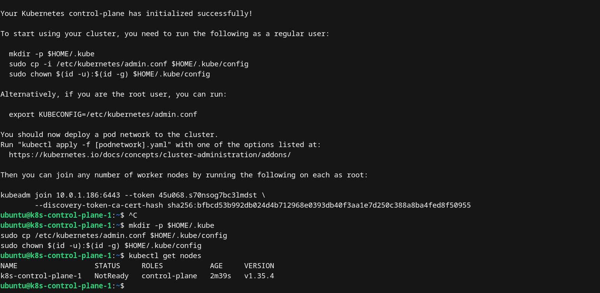
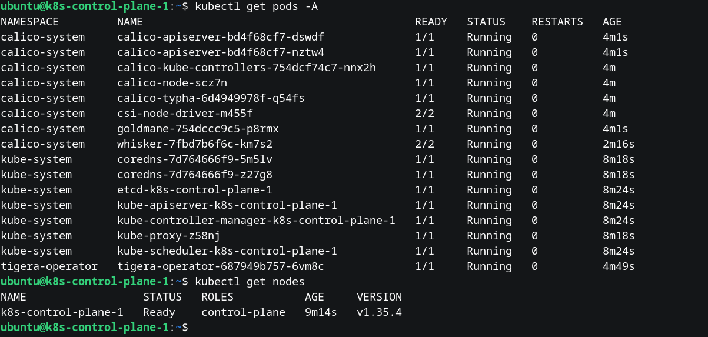
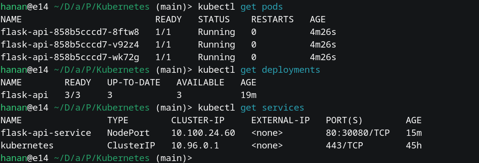
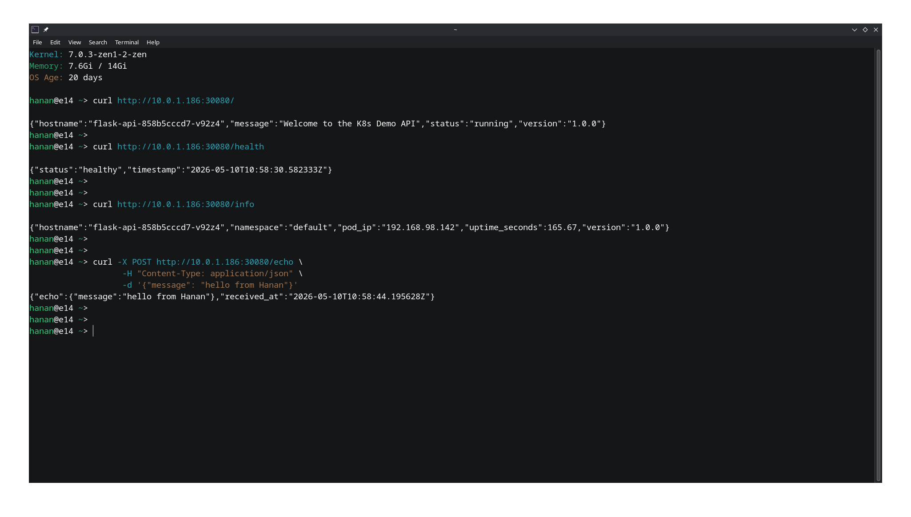

# Flask K8s API — Containerized Deployment on Self-Hosted Kubernetes

A simple REST API built with Python Flask, containerized with Docker, and deployed on a self-hosted Kubernetes cluster (kubeadm) running on a Proxmox VM.

---

## Repository Structure

```
.
├── app.py                    # Flask REST API
├── requirements.txt          # Python dependencies
├── Dockerfile                # Multi-stage Docker build
├── Kubernetes/
│   ├── deployment.yaml       # Kubernetes Deployment
│   └── service.yaml          # Kubernetes NodePort Service
├── screenshots/
│   ├── cluster-initialized.png
│   ├── cluster-ready-status.png
│   ├── cluster-ready-status.png
│   └── cluster-ready-status.png
└── README.md
```

---

## API Endpoints

| Method | Endpoint  | Description                             |
|--------|-----------|-----------------------------------------|
| GET    | `/`       | Welcome message, hostname, version      |
| GET    | `/health` | Liveness/readiness health check         |
| GET    | `/info`   | Pod info, uptime, namespace, IP         |
| POST   | `/echo`   | Echoes back any JSON body               |

---

## Part 1 — Application & Docker

1. Created the Python Flask REST API (`app.py`) and `requirements.txt`
2. Tested the app locally
3. Created a multi-stage `Dockerfile` for the application
4. Built the image and tested it by running a local Docker container
5. Pushed the image to DockerHub

```bash
docker build -t hananpp/flask-k8s-api:latest .
docker run -d -p 5000:5000 hananpp/flask-k8s-api:latest
curl http://localhost:5000/health

docker login
docker push hananpp/flask-k8s-api:latest
```

---

## Part 2 — SSH Hardening

Created Server on Ubuntu 24.04 VM on Proxmox (`10.0.1.186`)

**1. Copy public SSH key to the server**

```bash
ssh-copy-id ubuntu@10.0.1.186
```

**2. Disable password authentication, enable public key only**

```bash
sudo nano /etc/ssh/sshd_config
```

Set the following:
```
PubkeyAuthentication yes
PasswordAuthentication no
```

**3. Ubuntu 24.04 — also disable in cloud-init override file**

```bash
sudo nano /etc/ssh/sshd_config.d/50-cloud-init.conf
```

Comment out the line:
```
#PasswordAuthentication yes
```

**4. Restart SSH**

```bash
sudo systemctl restart ssh
```

---

## Part 3 — Kubernetes Cluster Setup (kubeadm)

### 3.1 — System Preparation

**Disable swap** (required by kubeadm):

```bash
sudo swapoff -a
sudo sed -i '/ swap / s/^/#/' /etc/fstab
```

**Load required kernel modules:**

```bash
cat <<EOF | sudo tee /etc/modules-load.d/k8s.conf
overlay
br_netfilter
EOF
sudo modprobe overlay
sudo modprobe br_netfilter
```

**Apply kernel networking settings:**

```bash
cat <<EOF | sudo tee /etc/sysctl.d/k8s.conf
net.bridge.bridge-nf-call-iptables  = 1
net.bridge.bridge-nf-call-ip6tables = 1
net.ipv4.ip_forward                 = 1
EOF
sudo sysctl --system
```

### 3.2 — Install containerd

```bash
sudo apt-get update
sudo apt-get install -y ca-certificates curl gnupg

sudo install -m 0755 -d /etc/apt/keyrings
curl -fsSL https://download.docker.com/linux/ubuntu/gpg | \
  sudo gpg --dearmor -o /etc/apt/keyrings/docker.gpg

sudo apt-get update
sudo apt-get install -y containerd.io
```

**Configure containerd with systemd cgroup driver:**

```bash
sudo containerd config default | sudo tee /etc/containerd/config.toml
sudo sed -i 's/SystemdCgroup = false/SystemdCgroup = true/' /etc/containerd/config.toml
sudo systemctl restart containerd
sudo systemctl enable containerd
```

### 3.3 — Install kubeadm, kubelet, kubectl (v1.35)

```bash
sudo apt-get install -y apt-transport-https

curl -fsSL https://pkgs.k8s.io/core:/stable:/v1.35/deb/Release.key | \
  sudo gpg --dearmor -o /etc/apt/keyrings/kubernetes-apt-keyring.gpg

echo 'deb [signed-by=/etc/apt/keyrings/kubernetes-apt-keyring.gpg] \
  https://pkgs.k8s.io/core:/stable:/v1.35/deb/ /' | \
  sudo tee /etc/apt/sources.list.d/kubernetes.list

sudo apt-get update
sudo apt-get install -y kubelet kubeadm kubectl
sudo apt-mark hold kubelet kubeadm kubectl
sudo systemctl enable kubelet
```

### 3.4 — Initialize the Cluster

```bash
sudo kubeadm init \
  --pod-network-cidr=192.168.0.0/16 \
  --apiserver-advertise-address=10.0.1.186 \
  --apiserver-cert-extra-sans=10.0.1.186
```



**Set up kubeconfig:**

```bash
mkdir -p $HOME/.kube
sudo cp /etc/kubernetes/admin.conf $HOME/.kube/config
sudo chown $(id -u):$(id -g) $HOME/.kube/config
```

### 3.5 — Install Calico CNI

```bash
kubectl create -f https://raw.githubusercontent.com/projectcalico/calico/v3.31.5/manifests/tigera-operator.yaml
kubectl create -f https://raw.githubusercontent.com/projectcalico/calico/v3.31.5/manifests/custom-resources.yaml
```



### 3.6 — Allow Scheduling on Control Plane (Single-Node)

```bash
kubectl taint nodes --all node-role.kubernetes.io/control-plane-
```

---

## Part 4 — Deploy the Application

**1. Created [`Kubernetes/deployment.yaml`](Kubernetes/deployment.yaml)** — uses the DockerHub image pushed earlier, 2 replicas, resource limits, liveness and readiness probes.

**2. Created [`Kubernetes/service.yaml`](Kubernetes/service.yaml)** — NodePort service exposing the API externally. NodePort was chosen since there is direct access to the node's IP.

**3. Apply manifests:**

```bash
kubectl apply -f Kubernetes/deployment.yaml
kubectl apply -f Kubernetes/service.yaml
```

**4. Verify:**

```bash
kubectl get pods
kubectl get deployments
kubectl get services
```



---

## Part 5 — Accessing the Application

The app is exposed on **NodePort 30080** on the server IP `10.0.1.186`.

```bash
# Root endpoint
curl http://10.0.1.186:30080/

# Health check
curl http://10.0.1.186:30080/health

# Pod info
curl http://10.0.1.186:30080/info

# Echo test
curl -X POST http://10.0.1.186:30080/echo \
  -H "Content-Type: application/json" \
  -d '{"message": "hello from Hanan"}'
```



---

## Security Notes

- SSH password authentication is **disabled**; only key-based auth is permitted.
- Ubuntu 24.04's cloud-init SSH override (`50-cloud-init.conf`) was also patched to prevent it re-enabling password auth.
- Docker image uses a **multi-stage build** to minimize image size.
- Container runs as a **non-root user** (`appuser`).
- Kubernetes Deployment includes **resource limits**, **liveness**, and **readiness probes**.

---

## Tech Stack

| Component      | Technology                              |
|----------------|-----------------------------------------|
| API            | Python 3.12 + Flask 3.0                 |
| WSGI Server    | Gunicorn                                |
| Container      | Docker (multi-stage)                    |
| Registry       | DockerHub                               |
| Orchestration  | Kubernetes 1.35 (kubeadm)              |
| CNI            | Calico v3.31.5                          |
| OS             | Ubuntu 24.04 LTS (Proxmox VM)           |
